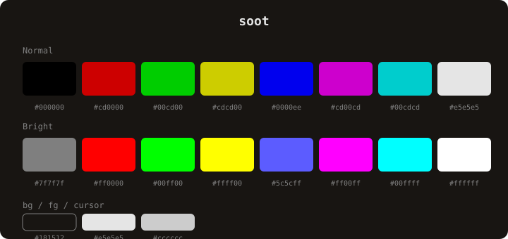

# payal

warm color scheme for [Ghostty](https://ghostty.org) terminal. available in dark and light variants.

## palette

### dark



### light


## installation

copy the theme file to your Ghostty themes directory:

```sh
cp payal.conf ~/.config/ghostty/themes/
cp payal-light.conf ~/.config/ghostty/themes/
```

then add to your Ghostty config:

```
config-file = "themes/payal.conf"
```

or for the light variant:

```
config-file = "themes/payal-light.conf"
```
